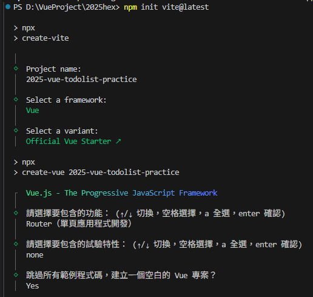

# Vue3 前端新手營｜2025最終挑戰 - Todolist 新手證書任務

[此 ReadMe文件 好讀版](https://suave-plow-955.notion.site/Vue3-2025-Todolist-25c44f12a9b880448402f282acae7308)

### Vue 應用功能

**第一週：Vue 環境、基礎概念與 Vue 指令**

- v-for （迴圈，類似 forEach）
- v-bind v-model （HTML 屬性套用）
- v-on（addEventListener）
- v-if, v-else（if…else 判斷）

**第二週 Vue Composition API，方法、監聽與 AJAX**

- Methods、Computed、Mounted 常見技巧
- Async Function ( Axios 套件 )

**第三週：Vue 與元件概念，Props 與 Emits**

- Props 與 Emits
- provide 與 inject ( 進階使用)

**第四週：Vue Router**

</aside>

<aside>

### 主要挑戰目標

- [ ]  **必做**：需使用 **Vue** 框架來挑戰，並整合此任務提供的 API
- [ ]  **必做**：需使用 **Vue Router**，並統一部署到 GitHub Pages
- [ ]  **必做**：待辦為零筆資料時，需顯示文字「目前尚無待辦事項」
- [ ]  **必做**：新增待辦功能
- [ ]  **必做**：移除待辦功能
- [ ]  **必做**：切換待辦狀態(打勾表示已完成、未勾表示待完成)
- [ ]  **必做**：狀態頁籤切換功能(全部、待完成、已完成)
- [ ]  **必做**：確認待完成項目總數 (5 個待完成項目)
- [ ]  **必做**：登入、註冊 API 功能
- [ ]  **必做**：需處理重複帳號註冊時， API 回傳錯誤時，需提醒用戶。(例：alert 彈跳、紅色文字顯示、SweetAlert2)


### 事前資料準備

- 設計稿：[*Figma 設計稿*](https://www.figma.com/design/MFSk8P5jmmC2ns9V9YeCzM/TodoList?node-id=0-1&t=j2ACFDnQScSBodiR-0)、 [Codepen CSS 排版](https://codepen.io/hexschool/pen/qBzEMdm)
- API：[文件網址](https://todolist-api.hexschool.io/doc/#/)
</aside>

# Step1. 安裝 vue3 環境

### **1 . 建立 Vite For Vue3 環境，在 VSCode 終端機模式下依序輸入**

```bash
npm init vite@latest 
```

- Project name： 2025-vue-todolist-practice
- Select a framework: ：Vue
- Select a variant：Official Vue Starter
- Vue.js - The Progressive JavaScript Framework
    - 請選擇要包含的功能：Router
    - 請選擇要包含的試驗特性：none ( 跳過不選 )
    - 跳過所有範例程式碼，建立一個空白的 Vue 專案？： Yes

```bash
cd 2025-vue-todolist-practice
# 跳轉到專案資料夾
npm install
# 安裝相關環境套件
npm run dev
# 執行專案環境
```




*初始資料夾路徑樣式

### **2 . 將 App.vue 預設 template 內容清空**

```jsx
<script setup></script>

<template>
  <!-- 將 Templata 預設內容移除 -->
  <h1>You did it!</h1>
  <p>
    Visit <a href="https://vuejs.org/" target="_blank" rel="noopener">vuejs.org</a> to read the
    documentation
  </p> -->
</template>

<style scoped></style>
```

### **3 . 建立 main.css 於 src/assets 資料夾中，並引入使用**

建立好資料夾與css檔案後，在 `src/main.js` 引入 `main.css`

```jsx

import { createApp } from 'vue'
import App from './App.vue'
import router from './router'
import './assets/main.css' //引入main.css

const app = createApp(App)

app.use(router)

app.mount('#app')
```

# Step2. 從 CodePen 範例置入樣式版型

### 開啟 Codepen ，將 html 與 css 樣式複製到專案中

> CodePen 範例連結 : [https://codepen.io/hexschool/pen/qBzEMdm](https://codepen.io/hexschool/pen/qBzEMdm)
> 

### App.vue

```jsx
<script setup></script>

<template>
  <!-- login_page -->
  <div id="loginPage" class="bg-yellow">
    <div class="conatiner loginPage vhContainer ">
      <div class="side">
        <a href="#"></a>
        
      </div>
      <div>
        <form class="formControls" action="index.html">
          <h2 class="formControls_txt">最實用的線上代辦事項服務</h2>
          <label class="formControls_label" for="email">Email</label>
          <input class="formControls_input" type="text" id="email" name="email" placeholder="請輸入 email" required>
          <span>此欄位不可留空</span>
          <label class="formControls_label" for="pwd">密碼</label>
          <input class="formControls_input" type="password" name="pwd" id="pwd" placeholder="請輸入密碼" required>
          <input class="formControls_btnSubmit" type="button" onclick="javascript:location.href='#todoListPage'"
            value="登入">
          <a class="formControls_btnLink" href="#signUpPage">註冊帳號</a>
        </form>
      </div>
    </div>
  </div>

  <!-- sign up -->
  <div id="signUpPage" class="bg-yellow">
    <div class="conatiner signUpPage vhContainer">
      <div class="side">
        <a href="#"></a>
        
      </div>
      <div>
        <form class="formControls" action="index.html">
          <h2 class="formControls_txt">註冊帳號</h2>
          <label class="formControls_label" for="email">Email</label>
          <input class="formControls_input" type="text" id="email" name="email" placeholder="請輸入 email" required>
          <label class="formControls_label" for="name">您的暱稱</label>
          <input class="formControls_input" type="text" name="name" id="name" placeholder="請輸入您的暱稱">
          <label class="formControls_label" for="pwd">密碼</label>
          <input class="formControls_input" type="password" name="pwd" id="pwd" placeholder="請輸入密碼" required>
          <label class="formControls_label" for="pwd">再次輸入密碼</label>
          <input class="formControls_input" type="password" name="pwd" id="pwd" placeholder="請再次輸入密碼" required>
          <input class="formControls_btnSubmit" type="button" onclick="javascript:location.href='#todoListPage'"
            value="註冊帳號">
          <a class="formControls_btnLink" href="#loginPage">登入</a>
        </form>
      </div>
    </div>

  </div>

  <!-- ToDo List -->
  <div id="todoListPage" class="bg-half">
    <nav>
      <h1><a href="#">ONLINE TODO LIST</a></h1>
      <ul>
        <li class="todo_sm"><a href="#"><span>王小明的代辦</span></a></li>
        <li><a href="#loginPage">登出</a></li>
      </ul>
    </nav>
    <div class="conatiner todoListPage vhContainer">
      <div class="todoList_Content">
        <div class="inputBox">
          <input type="text" placeholder="請輸入待辦事項">
          <a href="#">
            <i class="fa fa-plus"></i>
          </a>
        </div>
        <div class="todoList_list">
          <ul class="todoList_tab">
            <li><a href="#" class="active">全部</a></li>
            <li><a href="#">待完成</a></li>
            <li><a href="#">已完成</a></li>
          </ul>
          <div class="todoList_items">
            <ul class="todoList_item">
              <li>
                <label class="todoList_label">
                  <input class="todoList_input" type="checkbox" value="true">
                  <span>把冰箱發霉的檸檬拿去丟</span>
                </label>
                <a href="#">
                  <i class="fa fa-times"></i>
                </a>
              </li>
              <li>
                <label class="todoList_label">
                  <input class="todoList_input" type="checkbox" value="true">
                  <span>打電話叫媽媽匯款給我</span>
                </label>
                <a href="#">
                  <i class="fa fa-times"></i>
                </a>
              </li>
              <li>
                <label class="todoList_label">
                  <input class="todoList_input" type="checkbox" value="true">
                  <span>整理電腦資料夾</span>
                </label>
                <a href="#">
                  <i class="fa fa-times"></i>
                </a>
              </li>
              <li>
                <label class="todoList_label">
                  <input class="todoList_input" type="checkbox" value="true">
                  <span>繳電費水費瓦斯費</span>
                </label>
                <a href="#">
                  <i class="fa fa-times"></i>
                </a>
              </li>
              <li>
                <label class="todoList_label">
                  <input class="todoList_input" type="checkbox" value="true">
                  <span>約vicky禮拜三泡溫泉</span>
                </label>
                <a href="#">
                  <i class="fa fa-times"></i>
                </a>
              </li>
              <li>
                <label class="todoList_label">
                  <input class="todoList_input" type="checkbox" value="true">
                  <span>約ada禮拜四吃晚餐</span>
                </label>
                <a href="#">
                  <i class="fa fa-times"></i>
                </a>
              </li>
            </ul>
            <div class="todoList_statistics">
              <p> 5 個已完成項目</p>
            </div>
          </div>
        </div>
      </div>
    </div>
  </div>

</template>

<style scoped></style>

```

### src/assets/main.css

```css
@import url("https://fonts.googleapis.com/css2?family=Noto+Sans+TC&display=swap");
html, body, div, span, applet, object, iframe,
h1, h2, h3, h4, h5, h6, p, blockquote, pre,
a, abbr, acronym, address, big, cite, code,
del, dfn, em, img, ins, kbd, q, s, samp,
small, strike, strong, sub, sup, tt, var,
b, u, i, center,
dl, dt, dd, ol, ul, li,
fieldset, form, label, legend,
table, caption, tbody, tfoot, thead, tr, th, td,
article, aside, canvas, details, embed,
figure, figcaption, footer, header, hgroup,
menu, nav, output, ruby, section, summary,
time, mark, audio, video {
  margin: 0;
  padding: 0;
  border: 0;
  font-size: 100%;
  font: inherit;
  vertical-align: baseline;
}

/* HTML5 display-role reset for older browsers */
article, aside, details, figcaption, figure,
footer, header, hgroup, menu, nav, section {
  display: block;
}

body {
  line-height: 1;
}

ol, ul {
  list-style: none;
}

blockquote, q {
  quotes: none;
}

blockquote:before, blockquote:after,
q:before, q:after {
  content: '';
  content: none;
}

table {
  border-collapse: collapse;
  border-spacing: 0;
}

* {
  box-sizing: border-box;
  -moz-box-sizing: border-box;
  -webkit-box-sizing: border-box;
}

*, *::before, *::after {
  -webkit-box-sizing: border-box;
          box-sizing: border-box;
}

.selector-for-some-widget {
  -webkit-box-sizing: content-box;
          box-sizing: content-box;
}

html {
  height: 100%;
}

body {
  font-family: "Noto Sans TC";
  margin: 0 auto;
  overflow: hidden;
}

img {
  width: 100%;
  vertical-align: middle;
}

.logoImg {
  margin-bottom: 16px;
}

.vhContainer {
  height: 100vh;
}

.bg-yellow {
  background-color: #FFD370;
}

.bg-half {
  background-image: linear-gradient(175deg, #FFD370 60%, #fff 40%);
}

.conatiner {
  margin: 0 auto;
  padding: 87px 32px;
}

@media (max-width: 576px) {
  .conatiner {
    padding: 18px 32px;
  }
}

.side {
  width: 386px;
  -webkit-box-orient: vertical;
  -webkit-box-direction: normal;
      -ms-flex-direction: column;
          flex-direction: column;
  -webkit-box-pack: center;
      -ms-flex-pack: center;
          justify-content: center;
  -webkit-box-align: center;
      -ms-flex-align: center;
          align-items: center;
}

@media (max-width: 576px) {
  .side {
    width: 100%;
  }
}

nav {
  display: -webkit-box;
  display: -ms-flexbox;
  display: flex;
  -webkit-box-pack: justify;
      -ms-flex-pack: justify;
          justify-content: space-between;
  padding: 24px 32px 0 32px;
}

@media (max-width: 576px) {
  nav {
    margin-bottom: 16px;
  }
}

nav h1 a {
  width: 243px;
  height: 39px;
  background: url(https://upload.cc/i1/2022/03/23/8vTzYG.png) no-repeat;
  display: block;
  text-indent: 101%;
  overflow: hidden;
  white-space: nowrap;
}

nav ul {
  display: -webkit-box;
  display: -ms-flexbox;
  display: flex;
  font-size: 1rem;
}

@media (max-width: 576px) {
  nav ul li {
    margin-top: 11px;
  }
}

nav ul a {
  text-decoration: none;
  color: #333333;
  margin-left: 24px;
}

@media (max-width: 576px) {
  nav ul a {
    margin-left: 0;
  }
}

nav ul a:hover {
  color: #d87355;
}

nav ul a span {
  font-weight: bold;
}

@media (max-width: 576px) {
  nav ul .todo_sm {
    display: none;
  }
}

@media (max-width: 576px) {
  .d-m-n {
    display: none;
  }
}

.formControls {
  margin-left: 100px;
  display: -webkit-box;
  display: -ms-flexbox;
  display: flex;
  -webkit-box-orient: vertical;
  -webkit-box-direction: normal;
      -ms-flex-direction: column;
          flex-direction: column;
}

@media (max-width: 576px) {
  .formControls {
    margin-left: 0;
  }
}

.formControls .formControls_txt {
  font-size: 1.5rem;
  font-weight: bold;
  margin-bottom: 24px;
}

@media (max-width: 576px) {
  .formControls .formControls_txt {
    font-size: 1.25rem;
    text-align: center;
  }
}

.formControls .formControls_label {
  font-size: 0.875rem;
  font-weight: bold;
  margin: 16px 0 4px 0;
}

.formControls .formControls_input {
  font-weight: normal;
  border: none;
  border-radius: 10px;
  width: 304px;
  padding: 12px 16px;
  margin: 4px 0;
}

.formControls .formControls_input:focus {
  outline: 3px solid #fff;
}

.formControls .formControls_input::-webkit-input-placeholder {
  color: #9F9A91;
}

.formControls .formControls_input:-ms-input-placeholder {
  color: #9F9A91;
}

.formControls .formControls_input::-ms-input-placeholder {
  color: #9F9A91;
}

.formControls .formControls_input::placeholder {
  color: #9F9A91;
}

.formControls .formControls_btnSubmit {
  width: 128px;
  height: 48px;
  border: none;
  border-radius: 10px;
  background: #333333;
  color: #fff;
  -ms-flex-item-align: center;
      -ms-grid-row-align: center;
      align-self: center;
  margin: 24px 0;
  font-weight: bold;
  cursor: pointer;
  text-align: center;
  font-size: 1rem;
}

.formControls a {
  text-decoration: none;
}

.formControls span {
  margin: 4px 0 16px 0;
  color: #d87355;
  font-size: 0.875rem;
}

.formControls .formControls_btnLink {
  display: block;
  color: #333333;
  font-weight: bold;
  text-decoration: none;
  text-align: center;
}

.loginPage {
  display: -webkit-box;
  display: -ms-flexbox;
  display: flex;
  -webkit-box-pack: justify;
      -ms-flex-pack: justify;
          justify-content: space-between;
  -webkit-box-align: center;
      -ms-flex-align: center;
          align-items: center;
  width: 800px;
}

@media (max-width: 576px) {
  .loginPage {
    width: 100%;
    -webkit-box-orient: vertical;
    -webkit-box-direction: normal;
        -ms-flex-direction: column;
            flex-direction: column;
    margin: 0 auto;
    padding: 48px 31px;
    -webkit-box-pack: start;
        -ms-flex-pack: start;
            justify-content: start;
  }
}

.signUpPage {
  display: -webkit-box;
  display: -ms-flexbox;
  display: flex;
  -webkit-box-pack: justify;
      -ms-flex-pack: justify;
          justify-content: space-between;
  -webkit-box-align: center;
      -ms-flex-align: center;
          align-items: center;
  width: 800px;
}

@media (max-width: 576px) {
  .signUpPage {
    width: 100%;
    -webkit-box-orient: vertical;
    -webkit-box-direction: normal;
        -ms-flex-direction: column;
            flex-direction: column;
    margin: 48px auto 0 auto;
    padding: 48px 31px;
  }
}

.todoListPage {
  padding: 16px 32px;
}

@media (max-width: 576px) {
  .todoListPage {
    background-image: linear-gradient(175deg, #FFD370 100%, #fff 0%);
  }
}

.todoList_Content {
  width: 500px;
  margin: 0 auto;
}

@media (max-width: 576px) {
  .todoList_Content {
    width: 100%;
  }
}

.inputBox {
  width: 100%;
  display: -webkit-box;
  display: -ms-flexbox;
  display: flex;
  position: relative;
  margin-bottom: 16px;
  -webkit-box-shadow: 0 0 15px 0 rgba(0, 0, 0, 0.15);
          box-shadow: 0 0 15px 0 rgba(0, 0, 0, 0.15);
}

.inputBox input {
  background: #fff;
  border: none;
  border-radius: 10px;
  position: relative;
  width: 100%;
  height: 47px;
  font-size: 1rem;
  padding-left: 16px;
}

.inputBox a {
  display: block;
  width: 40px;
  height: 39px;
  position: absolute;
  background: #333333;
  color: white;
  font-size: 20px;
  text-decoration: none;
  text-align: center;
  border-radius: 10px;
  top: 4px;
  right: 4px;
  padding: 10px;
}

.todoList_list {
  background: #fff;
  border-radius: 10px;
  -webkit-box-shadow: 0 0 15px 0 rgba(0, 0, 0, 0.15);
          box-shadow: 0 0 15px 0 rgba(0, 0, 0, 0.15);
}

.todoList_list .todoList_tab {
  display: -webkit-box;
  display: -ms-flexbox;
  display: flex;
  -webkit-box-pack: space-evenly;
      -ms-flex-pack: space-evenly;
          justify-content: space-evenly;
}

.todoList_list .todoList_tab li {
  width: 100%;
}

.todoList_list .todoList_tab a {
  display: block;
  color: #9F9A91;
  text-decoration: none;
  line-height: 20px;
  font-weight: bold;
  text-align: center;
  padding: 16px;
  border-bottom: 2px solid #efefef;
}

.todoList_list .todoList_tab .active {
  color: #333333;
  border-bottom: 2px solid #333333;
}

.todoList_list .todoList_items {
  padding-top: 23px;
  padding-left: 24px;
  padding-right: 17px;
  padding-bottom: 32px;
}

.todoList_list .todoList_items .todoList_item {
  margin-bottom: 8px;
}

.todoList_list .todoList_items .todoList_label {
  width: 100%;
  display: -webkit-box;
  display: -ms-flexbox;
  display: flex;
  -webkit-box-align: center;
      -ms-flex-align: center;
          align-items: center;
  border-bottom: 1px solid #e5e5e5;
  padding-bottom: 15px;
  color: #333333;
  line-height: 20.27px;
}

.todoList_list .todoList_items .todoList_input {
  width: 20px;
  height: 20px;
  border: 1px solid #9F9A91;
  border-radius: 5px;
  margin-right: 16px;
}

.todoList_list .todoList_items .todoList_input:checked ~ span {
  color: #9F9A91;
  text-decoration: line-through;
  -webkit-transition: all 0.4s ease-in-out;
  transition: all 0.4s ease-in-out;
}

.todoList_list .todoList_items li {
  display: -webkit-box;
  display: -ms-flexbox;
  display: flex;
  -webkit-box-align: center;
      -ms-flex-align: center;
          align-items: center;
  margin-bottom: 17px;
}

.todoList_list .todoList_items li a {
  margin-left: 17px;
  display: block;
  font-size: 14px;
  color: #333333;
  opacity: 0;
}

.todoList_list .todoList_items li:hover a {
  opacity: 1;
}

.todoList_list .todoList_statistics {
  display: -webkit-box;
  display: -ms-flexbox;
  display: flex;
  -webkit-box-pack: justify;
      -ms-flex-pack: justify;
          justify-content: space-between;
}

.todoList_list .todoList_statistics p {
  color: #333333;
  font-size: 0.875rem;
}

.todoList_list .todoList_statistics a {
  color: #9F9A91;
  font-size: 0.875rem;
  text-decoration: none;
}
/*# sourceMappingURL=all.css.map */
```


啟動時會看到的畫面

# Step3. 參考 Figma 切版，分別建立各個 View 畫面

### 開啟 Figma  範本，將頁面拆分成 3 個 vue 頁面檔案

從 App.vue 的部分去拆解，並於 src 資料夾下分別建立 views 資料夾，並建立以下檔案

- **`HomeView.vue`** : 主頁/登入頁面 ⇒ 對應 <!-- login_page - ->
- **`SignUpView.vue`** : 註冊頁面 ⇒ 對應 <!-- sign up - ->
- **`TodoListView.vue`** : 代辦事項頁面 ⇒ 對應 <!-- ToDo List - - >

### HomeView.vue

```jsx
<script setup></script>

<template>
    <!-- login_page -->
    <div id="loginPage" class="bg-yellow">
        <div class="conatiner loginPage vhContainer ">
            <div class="side">
                <a href="#"></a>
                
            </div>
            <div>
                <form class="formControls" action="index.html">
                    <h2 class="formControls_txt">最實用的線上代辦事項服務</h2>
                    <label class="formControls_label" for="email">Email</label>
                    <input class="formControls_input" type="text" id="email" name="email" placeholder="請輸入 email"
                        required>
                    <span>此欄位不可留空</span>
                    <label class="formControls_label" for="pwd">密碼</label>
                    <input class="formControls_input" type="password" name="pwd" id="pwd" placeholder="請輸入密碼" required>
                    <input class="formControls_btnSubmit" type="button"
                        onclick="javascript:location.href='#todoListPage'" value="登入">
                    <a class="formControls_btnLink" href="#signUpPage">註冊帳號</a>
                </form>
            </div>
        </div>
    </div>
</template>

<style scoped></style>

```

### SignUpView.vue

```css
<script setup></script>

<template>
    <!-- sign up -->
    <div id="signUpPage" class="bg-yellow">
        <div class="conatiner signUpPage vhContainer">
            <div class="side">
                <a href="#"></a>
                
            </div>
            <div>
                <form class="formControls" action="index.html">
                    <h2 class="formControls_txt">註冊帳號</h2>
                    <label class="formControls_label" for="email">Email</label>
                    <input class="formControls_input" type="text" id="email" name="email" placeholder="請輸入 email"
                        required>
                    <label class="formControls_label" for="name">您的暱稱</label>
                    <input class="formControls_input" type="text" name="name" id="name" placeholder="請輸入您的暱稱">
                    <label class="formControls_label" for="pwd">密碼</label>
                    <input class="formControls_input" type="password" name="pwd" id="pwd" placeholder="請輸入密碼" required>
                    <label class="formControls_label" for="pwd">再次輸入密碼</label>
                    <input class="formControls_input" type="password" name="pwd" id="pwd" placeholder="請再次輸入密碼"
                        required>
                    <input class="formControls_btnSubmit" type="button"
                        onclick="javascript:location.href='#todoListPage'" value="註冊帳號">
                    <a class="formControls_btnLink" href="#loginPage">登入</a>
                </form>
            </div>
        </div>

    </div>
</template>

<style scoped></style>

```

### TodoListView.vue

```css
<script setup></script>

<template>
    <!-- ToDo List -->
    <div id="todoListPage" class="bg-half">
        <nav>
            <h1><a href="#">ONLINE TODO LIST</a></h1>
            <ul>
                <li class="todo_sm"><a href="#"><span>王小明的代辦</span></a></li>
                <li><a href="#loginPage">登出</a></li>
            </ul>
        </nav>
        <div class="conatiner todoListPage vhContainer">
            <div class="todoList_Content">
                <div class="inputBox">
                    <input type="text" placeholder="請輸入待辦事項">
                    <a href="#">
                        <i class="fa fa-plus"></i>
                    </a>
                </div>
                <div class="todoList_list">
                    <ul class="todoList_tab">
                        <li><a href="#" class="active">全部</a></li>
                        <li><a href="#">待完成</a></li>
                        <li><a href="#">已完成</a></li>
                    </ul>
                    <div class="todoList_items">
                        <ul class="todoList_item">
                            <li>
                                <label class="todoList_label">
                                    <input class="todoList_input" type="checkbox" value="true">
                                    <span>把冰箱發霉的檸檬拿去丟</span>
                                </label>
                                <a href="#">
                                    <i class="fa fa-times"></i>
                                </a>
                            </li>
                            <li>
                                <label class="todoList_label">
                                    <input class="todoList_input" type="checkbox" value="true">
                                    <span>打電話叫媽媽匯款給我</span>
                                </label>
                                <a href="#">
                                    <i class="fa fa-times"></i>
                                </a>
                            </li>
                            <li>
                                <label class="todoList_label">
                                    <input class="todoList_input" type="checkbox" value="true">
                                    <span>整理電腦資料夾</span>
                                </label>
                                <a href="#">
                                    <i class="fa fa-times"></i>
                                </a>
                            </li>
                            <li>
                                <label class="todoList_label">
                                    <input class="todoList_input" type="checkbox" value="true">
                                    <span>繳電費水費瓦斯費</span>
                                </label>
                                <a href="#">
                                    <i class="fa fa-times"></i>
                                </a>
                            </li>
                            <li>
                                <label class="todoList_label">
                                    <input class="todoList_input" type="checkbox" value="true">
                                    <span>約vicky禮拜三泡溫泉</span>
                                </label>
                                <a href="#">
                                    <i class="fa fa-times"></i>
                                </a>
                            </li>
                            <li>
                                <label class="todoList_label">
                                    <input class="todoList_input" type="checkbox" value="true">
                                    <span>約ada禮拜四吃晚餐</span>
                                </label>
                                <a href="#">
                                    <i class="fa fa-times"></i>
                                </a>
                            </li>
                        </ul>
                        <div class="todoList_statistics">
                            <p> 5 個已完成項目</p>
                        </div>
                    </div>
                </div>
            </div>
        </div>
    </div>

</template>

<style scoped></style>

```

<aside>
💡

如何測試？

可以在 App.vue 中，分別 import 來觀看效果

```jsx
<script setup>
import HomeView from './views/HomeView.vue';
import TodoListView from './views/TodoListView.vue';
import SignUpView from './views/SignUpView.vue';
</script>

<template>
  <!-- <HomeView /> -->
  <!-- <TodoListView /> -->
  <!-- <SignUpView /> -->
</template>

<style scoped></style>
```

</aside>

# Step4. 建立 Router 路由連結

### 於 `router/index.js` 新增 Router 名稱及對應頁面

> 另有新增例外頁面 : NotFoundView.vue
> 

### router/index.js

```jsx
// import { createRouter, createWebHistory } from 'vue-router'
import { createRouter, createWebHashHistory } from 'vue-router'//因為github page 或是靜態伺服器上，建議用#錨點類型
import HomeView from '../views/HomeView.vue'
import NotFound from '../views/NotFoundView.vue'

const router = createRouter({
  history: createWebHashHistory(import.meta.env.BASE_URL),
  routes: [
    {
      path: '/',
      name: 'home',
      component: HomeView,
    },
    {
      path: '/signin',
      name: 'signin',
      component: HomeView,
    },
    {
      path: '/signup',
      name: 'signup',
      component: () => import('../views/SignUpView.vue'),
    },
    {
      path: '/todoList',
      name: 'todoList',
      component: () => import('../views/TodoListView.vue'),
      // children: [　//巢狀路由，有多少就繼續接下去
      //   {
      //     path: '/todoList',
      //     name: 'todoList',
      //     component: () => import('../views/TodoListView.vue'),
      //   }
      // ]
    },
    {
      //404頁面
      path: '/:pathMatch(.*)*',
      name: 'NotFound',
      component: NotFound
    }
  ],
})

export default router

```

### App.vue

```jsx
<script setup>
import { RouterLink, RouterView } from 'vue-router'
</script>

<template>
  <RouterView />
</template>

```

# Step5. 登入/註冊頁 建立 **Composition API 及**欄位綁定

- `v-model`：同步輸入框值和 `signInField.email`。
- `@blur`：輸入框失焦 → `emailTouched = true`，觸發錯誤提示顯示。
- `@focus`：輸入框重新被點擊 → `emailTouched = false`，隱藏錯誤提示。
- `v-on:click`：按鈕點擊事件

### HomeView.vue

```jsx
<template>
    <!-- 前後省略 -->
		<label class="formControls_label" for="email">Email</label>
    <input class="formControls_input" type="text" id="email" name="email" placeholder="請輸入 email"
        required v-model="signInField.email" @blur="emailTouched = true" @focus="emailTouched = false">

    <span v-if="emailTouched && signInField.email === ''">此欄位不可留空</span>
    <span v-else-if="emailTouched && !isValidEmail(signInField.email)">Email 格式不正確</span>

    <label class="formControls_label" for="pwd">密碼</label>
    <input class="formControls_input" type="password" name="pwd" id="pwd" placeholder="請輸入密碼" required
        v-model="signInField.password" @blur="passwordTouched = true" @focus="passwordTouched = false">
    <span v-if="passwordTouched && signInField.password === ''">此欄位不可留空</span>
    <input class="formControls_btnSubmit" type="button" v-on:click="onSignIn" value="登入">
     <!-- 前後省略 -->
</template>

<script setup>

import { ref } from 'vue';

//UI狀態
const emailTouched = ref(false); //email的點擊狀態
const passwordTouched = ref(false);

//使用者登入欄位
const signInField = ref({
    email: '',
    password: ''
});

//按下登入時
const onSignIn = () => {
    console.log(signInField.value);
}

//前端先檢查是否為有效帳號
const isValidEmail = (email) => {
    const emailRegex = /^[^\s@]+@[^\s@]+\.[^\s@]+$/;
    return emailRegex.test(email.trim());
}

</script>
```

### SignUpView.vue

```jsx
<template>
  <!-- 前後省略 -->
      <form class="formControls" action="index.html">
          <h2 class="formControls_txt">註冊帳號</h2>
          <label class="formControls_label" for="email">Email</label>
          <input class="formControls_input" type="text" id="email" name="email" placeholder="請輸入 email"
              required v-model="signUpField.email">

          <label class="formControls_label" for="name">您的暱稱</label>
          <input class="formControls_input" type="text" name="name" id="name" placeholder="請輸入您的暱稱"
              v-model="signUpField.nickname">

          <label class="formControls_label" for="pwd">密碼</label>
          <input class="formControls_input" type="password" name="pwd" id="pwd" placeholder="請輸入密碼" required
              v-model="signUpField.password">

          <label class="formControls_label" for="pwd">再次輸入密碼</label>
          <input class="formControls_input" type="password" name="pwd" id="pwd" placeholder="請再次輸入密碼" required
              v-model="signUpPWCheck">

          <span v-if="errMessage" style="align-self: center; padding-top: 3px;">{{ errMessage }}</span>

          <input class="formControls_btnSubmit" type="button" v-on:click="onSignup" value="註冊帳號">
          <a class="formControls_btnLink" href="#">登入</a>
      </form>
       <!-- 前後省略 -->
</template>

<script setup>
	 import { ref } from 'vue';

		//使用者註冊欄位
		const signUpField = ref({
		    nickname: '',
		    email: '',
		    password: ''
		});
		
		const errMessage = ref('');//錯誤訊息
		const signUpPWCheck = ref(''); // 雙重密碼確認
		
		//前端先檢查是否為有效帳號
		//可以共用
		const isValidEmail = (email) => {
		    const emailRegex = /^[^\s@]+@[^\s@]+\.[^\s@]+$/;
		    return emailRegex.test(email.trim());
		}
		
		const onSignup = async () => {
		    errMessage.value = '';
		
		    if (signUpField.value.password !== signUpPWCheck.value) {
		        errMessage.value = '兩次密碼欄位輸入不一致'
		        return;
		    };
		
		    if (signUpField.value.nickname === '' ||
		        signUpField.value.email === '' ||
		        signUpField.value.password === ''
		    ) {
		        errMessage.value = '欄位不可留空';
		        return;
		    }
		
		    if (!isValidEmail(signUpField.value.email)) {
		        errMessage.value = 'Email 帳號格式不正確';
		        return;
		    }
		};
</script>

```

<aside>
📌

新增功能：

- 輸入框失焦／重新點擊的事件監聽及檢查
- 使用正規表示法檢查 Email 欄位格式是否正確
- 新增錯誤訊息
</aside>

# Step6. 使用 axios 串接 API，實現登入 / 註冊 / 登入驗證 / 取得Todo資料

### **1 .  安裝 axios 套件**

```bash
npm init axios 
```

### **2 . 若有用到 axios 都需引入功能**

```jsx
import axios from 'axios';
```

### **3 . 依照文件新增 api.js 相關設定檔案於 utils 資料夾內**

```jsx
// src/utils/api.js
//API文件來源 : https://todolist-api.hexschool.io/doc/
const BASE_API_URL = 'https://todolist-api.hexschool.io';

// API 路徑常數
export const POST_SIGN_IN = 'users/sign_in';        //登入
export const POST_SIGN_UP = 'users/sign_up';        //註冊
export const GET_USER_CHECKOUT = 'users/checkout';  //驗證使用者
export const POST_SIGN_OUT = 'users/sign_out';      //登出
export const GET_TODOS = 'todos/';              //取得代辦清單 
export const POST_TODOS = 'todos/';             //新增代辦事項
export const PUT_TODOS = 'todos/{id}';        //更新代辦事項
export const DELETE_TODOS = 'todos/{id}';     //刪除代辦事項
export const PATCH_TODOS = 'todos/{id}/toggle'; //切換代辦事項完成狀態

// 格式化 URL
// 如果要帶參數 formatAPIUrl(PUT_TODOS, ){ id: 123 }; 
export function formatAPIUrl(path, params = {}) {
    let requestPath = path;

    // 替換路徑參數 {xxx}
    for (const [key, value] of Object.entries(params)) {
        requestPath = requestPath.replace(`{${key}}`, value);
    }

    const requestURL = `${BASE_API_URL}/${requestPath}`;
    console.log('API Request URL:', requestURL);
    return requestURL;
}
```

### **4 . 依序將 API 請求寫於各個頁面中**

### HomeView.vue

```jsx
<script setup>
import { POST_SIGN_IN, GET_USER_CHECKOUT, formatAPIUrl } from '@/utils/api';

const signinRes = ref('');
//按下登入時
const onSignIn = async () => {
    console.log(signInField.value);
    errMessage.value = '';
    emailTouched.value = false;

    //TODO : 還可以先做欄位檢查

    await axios.post(formatAPIUrl(POST_SIGN_IN), signInField.value)
        .then((res) => {
            console.log('signup response:', res);
            signinRes.value = res.data.uid;
            document.cookie = `customTodoToken=${res.data.token};path=/`;
            alert(`你好 ${res.data.nickname}，已成功登入 \n`);
            user.nickname = res.data.nickname;
            onCheckout();//驗證並登入
        }).catch((error) => {
            console.log('signup error:', error);
            errMessage.value = '請確認是否輸入正確 : ' + error.response.data.message;
        }).finally(() => {
            
        });
   
}

//如果有使用者Token，做登入
const onCheckout = async () => {
    try {// 驗證登入
        const token = document.cookie.replace(/(?:^|.*;\s*)customTodoToken\s*=\s*([^;]*).*$/i, "$1");
        const res = await axios.get(formatAPIUrl(GET_USER_CHECKOUT), {
            headers: {
                Authorization: token
            }
        }).then((res) => {
            if (res.data.status === true) {
                getTodoDataPage();
            }
            user.value = res.data;
        });
    }
    catch (error) {
    }
}

</script>
```

### SignUpView.vue

```jsx
<script setup>
		import axios from 'axios';
	 import { POST_SIGN_UP, formatAPIUrl } from '@/utils/api';

		
const onSignup = async () => {
    errMessage.value = '';

    //TODO:可再復查欄位資料正確性
    await axios.post(formatAPIUrl(POST_SIGN_UP), signUpField.value).then((res) => {
        console.log('signup response:', res);
        res.value = res.data.uid;
        alert(`${signUpField.value.nickname} 你好，你已註冊成功`);

        window.location.href = `#/`;
        //清空資料
    }).catch((error) => {
        console.log("錯誤！")
        console.log(error)
        errMessage.value = '錯誤:' + error.response.data.message;
    }).finally(() => {
        loadConfig.value.modelValue = false;
    });

};
</script>

```

### TodoListView.vue

```jsx
<script setup>
		import axios from 'axios';
	 import { GET_USER_CHECKOUT, GET_TODOS, POST_SIGN_OUT, POST_TODOS, PUT_TODOS, DELETE_TODOS, PATCH_TODOS, formatAPIUrl } from '@/utils/api';

const token = ref(''); //暫存使用者Token

//取得資料狀態，因為是初始化內容，做Loading處理
const getTodoDatas = async () => {

    loadConfig.value.message = '代辦事項載入中…';
    loadConfig.value.modelValue = true;

    // console.log(token.value);
    await axios.get(formatAPIUrl(GET_TODOS), {
        headers: {
            Authorization: token.value
        }
    }).then((res) => {
        console.log(res);
        if (loginIn.value == false) {
            loginIn.value = true;
        }
        todoDatas.value = res.data.data;
    }).catch((e) => {
        console.log(e);
    }).finally(() => {
        loadConfig.value.modelValue = false;
    });
}

//登出
const onSignOut = async () => {

    loadConfig.value.message = '正在登出...';
    loadConfig.value.modelValue = true;

    await axios.post(formatAPIUrl(POST_SIGN_OUT), {}, {
        headers: {
            Authorization: token.value
        }
    }).then((res) => {
        console.log(res);
        loginIn.value = false;
        token.value = '';
        alert('已成功登出');
        window.location.href = `#/`;
    }).catch((e) => {
        console.log(e);
    }).finally(() => {
        loadConfig.value.modelValue = false;
    });
}

//新增待辦事項
const addTodos = async (todoData, successCallback) => {
    loadConfig.value.message = '正在新增項目...';
    loadConfig.value.modelValue = true;

    await axios.post(formatAPIUrl(POST_TODOS), todoData, {
        headers: {
            Authorization: token.value
        }
    }).then((res) => {
        if (res.data.status === true) {
            todoDatas.value.push(res.data.newTodo);
        }
        alert('新增待辦事項成功！');
        successCallback(); //做清除欄位
    }).catch((error) => {
        console.log(`POST_TODOS : ${error}`);
    }).finally(() => {
        loadConfig.value.modelValue = false;
    });;

}

//修改編輯事項
const editTodos = async (todoData) => {

    loadConfig.value.message = '正在修改項目...';
    loadConfig.value.modelValue = true;

    const newTodoValue = {
        content: todoData.content
    };

    await axios.put(formatAPIUrl(PUT_TODOS, { id: todoData.id }), newTodoValue, {
        headers: {
            Authorization: token
        }
    }).then((res) => {
        alert('修改待辦事項成功！');
    }).catch((error) => {
        console.log(`POST_TODOS : ${error}`);
    }).finally(() => {
        loadConfig.value.modelValue = false;
    });
}

//修改事項狀態
const switchTodoStatus = async (todoData) => {

    loadConfig.value.message = '正在調整項目...';
    loadConfig.value.modelValue = true;

    await axios.patch(formatAPIUrl(PATCH_TODOS, { id: todoData.id }), null, {
        headers: {
            Authorization: token.value
        }
    }).then((res) => {
        alert('更改待辦事項成功！');
    }).catch((error) => {
        console.log(error);
    }).finally(() => {
        loadConfig.value.modelValue = false;
    });
}

//刪除事項
const deleteTodos = async (todoId) => {

    loadConfig.value.message = '正在刪除項目...';
    loadConfig.value.modelValue = true;

    await axios.delete(formatAPIUrl(DELETE_TODOS, { id: todoId }), {
        headers: {
            Authorization: token.value
        }
    }).then((res) => {
        alert('已刪除代辦事項!');
        todoDatas.value = todoDatas.value.filter(item => item.id !== todoId);
    }).catch((error) => {
        console.log(error);
    }).finally(() => {
        loadConfig.value.modelValue = false;
    });
}

//驗證登入
const checkToken = async () => {
    token.value = document.cookie.replace(/(?:^|.*;\s*)customTodoToken\s*=\s*([^;]*).*$/i, "$1");
    if (token.value === ``) {
        alert(`登入驗證已過期，請重新登入`);
        window.location.href = `#/`;
        return false;
    }
    else {
        await axios.get(formatAPIUrl(GET_USER_CHECKOUT), {
            headers: {
                Authorization: token.value
            }
        }).then((res) => {
            user.value = res.data;
            console.log(user.value);
        }).catch((e) => {
            alert(`登入驗證已過期，請重新登入`);
            window.location.href = `#/`;
            return false;
        });

        return true;
    }
}

onMounted(async () => {

    if (await checkToken() == false) {//初始驗證登入
        return;
    }
    getTodoDatas(); //如果有過就取資料

    //測試用
    // setTimeout(() => {
    //     loadConfig.value.message = '處理中…';
    //     loadConfig.value.modelValue = true;
    // }, 1000)
})
</script>

```

# Step7. 新增 TodosList.vue  實作 Prop / Emit 父子層級之間資料傳遞

### Prop  ( 由 TodoListView ⇒ TodoList ，將清單顯示 )

### TodoList.vue (子層)

```jsx
<template>
    <!-- 前後省略 -->
		<label class="formControls_label" for="email">Email</label>
    <input class="formControls_input" type="text" id="email" name="email" placeholder="請輸入 email"
        required v-model="signInField.email" @blur="emailTouched = true" @focus="emailTouched = false">

    <span v-if="emailTouched && signInField.email === ''">此欄位不可留空</span>
    <span v-else-if="emailTouched && !isValidEmail(signInField.email)">Email 格式不正確</span>

    <label class="formControls_label" for="pwd">密碼</label>
    <input class="formControls_input" type="password" name="pwd" id="pwd" placeholder="請輸入密碼" required
        v-model="signInField.password" @blur="passwordTouched = true" @focus="passwordTouched = false">
    <span v-if="passwordTouched && signInField.password === ''">此欄位不可留空</span>
    <input class="formControls_btnSubmit" type="button" v-on:click="onSignIn" value="登入">
     <!-- 前後省略 -->
</template>

<script setup>
import { ref } from 'vue';

//定義要傳入的子層 prop 
const prop = defineProps({
    todoDatas: {
        type: Array,
        required: true
    }
});

</script>
```

### TodoListView .vue ( 父層 )

```jsx
<template>
    <!-- ToDo List -->
    <div id="todoListPage" class="bg-half">
        <nav>
            <h1><a href="#">ONLINE TODO LIST</a></h1>
            <ul>
                <li class="todo_sm"><a href="#/todoList"><span>{{ user.nickname }} 的代辦</span></a></li>
                <li><a href="#" v-on:click="onSignOut">登出</a></li>
            </ul>
        </nav>
        <div class="conatiner todoListPage vhContainer">
            <TodosList 
            :todoDatas="todoDatas" 
            @add-todo="addTodos"  
            />
        </div>
    </div>

</template>

<script setup>
	 import TodosList from '@/component/TodosList.vue';
	 const todoDatas = ref([]); //目前使用者的代辦清單
	 
</script>

```

### Emit  ( 由 TodoList 定義函式 ⇒ TodoListView 做邏輯處理 )

### TodoList.vue (子層)

```jsx
<template>
				<div class="inputBox">
            <input type="text" placeholder="請輸入待辦事項" v-model="newTodoField.content">
            <a v-on:click="addtodos">
                <i class="fa fa-plus"></i>
            </a>
        </div>
</template>

<script setup>

//設定emit給予父層處理對應函式
const emit = defineEmits(['add-todo', 'edit-todo', 'delete-todo', 'switch-todo-status']);

const addtodos = () => {
    if (newTodoField.value.content.trim() === '') {
        alert('請輸入代辦事項內容');
        return;
    }
    emit('add-todo', newTodoField.value, () => { newTodoField.value = '' });
}

</script>
```

### TodoListView .vue ( 父層 )

```jsx
<template>
    <!-- ToDo List -->
    <div id="todoListPage" class="bg-half">
        <nav>
            <h1><a href="#">ONLINE TODO LIST</a></h1>
            <ul>
                <li class="todo_sm"><a href="#/todoList"><span>{{ user.nickname }} 的代辦</span></a></li>
                <li><a href="#" v-on:click="onSignOut">登出</a></li>
            </ul>
        </nav>
        <div class="conatiner todoListPage vhContainer">
            <TodosList 
            :todoDatas="todoDatas" 
            @add-todo="addTodos"  
            />
        </div>
    </div>

</template>

<script setup>
import TodosList from '@/component/TodosList.vue';
	 //新增待辦事項
const addTodos = async (todoData, successCallback) => {
  
}
	 
</script>

```

# Step8.  App.vue  實作全域資料存取 及 讀取頁面，實作 provide / inject

### 1. 於 App.vue 建立 Provide 功能，存放使用者資料 userData

### App.vue ( Provide 提供層)

```jsx
<template>
</template>

<script setup>
import { ref, provide, onMounted, watch, onUnmounted } from 'vue';

const userData = ref({
  nickname: '',
  uid: ''
})

//以provide作封裝存取
provide('getUserData', userData);
provide('setUserData', (data) => {
  if (data === null) {
    return;
  }
  userData.value = data;
})

</script>
```

### TodoListView .vue ( Inject 注入層 )

```jsx
<template>
        <nav>
            <h1><a href="#">ONLINE TODO LIST</a></h1>
            <ul>
                <li class="todo_sm"><a href="#/todoList"><span>{{ user.nickname }} 的代辦</span></a></li>
                <li><a href="#" v-on:click="onSignOut">登出</a></li>
            </ul>
        </nav>
</template>

<script setup>
	 import { ref, onMounted, inject } from 'vue';
	 
	 const user = inject('getUserData', { nickname: '訪客', uid: '' }); // 第二個參數是沒有帶入參數時的預設值
	 
	 //驗證登入，並取得使用者資料
	const checkToken = async () => {
	    token.value = document.cookie.replace(/(?:^|.*;\s*)customTodoToken\s*=\s*([^;]*).*$/i, "$1");
	    if (token.value === ``) {
	        alert(`登入驗證已過期，請重新登入`);
	        window.location.href = `#/`;
	        return false;
	    }
	    else {
	        await axios.get(formatAPIUrl(GET_USER_CHECKOUT), {
	            headers: {
	                Authorization: token.value
	            }
	        }).then((res) => {
	            user.value = res.data;
	            console.log(user.value);
	        }).catch((e) => {
	            alert(`登入驗證已過期，請重新登入`);
	            window.location.href = `#/`;
	            return false;
	        });
	
	        return true;
	    }
	}
</script>

```

### 2. 使用 ChatGPT 5 提供讀取用介面，併置入於 App.vue 中

### App.vue ( Provide 提供層)

```jsx
<template>
				<!--讀取用-->
			  <div v-if="loadConfig.modelValue" class="loading-overlay" :style="{ zIndex: loadConfig.zIndex }" role="status"
			    aria-live="polite" aria-busy="true" @click.self="onOverlayClick">
			    <div class="loading-card" :class="{ 'no-backdrop': !loadConfig.backdrop }">
			      <i class="fa-solid fa-spinner fa-spin fa-2x" aria-hidden="true"></i>
			      <p class="loading-text">{{ loadConfig.message }}</p>
			    </div>
			  </div>
			  
			  <RouterView /> //原本的Router
</template>

<script setup>

import { ref, provide, onMounted, watch, onUnmounted } from 'vue';

const loadConfig = ref({
  modelValue: false,      // 是否顯示覆蓋層
  message: '載入中...',     // 顯示文字
  zIndex: 1100,           // 疊層順序
  backdrop: true,         // 是否顯示半透明背景（這裡只是用來決定卡片樣式）
  lockScroll: true,       // 顯示時是否鎖住 body 捲動
  closable: false,        // 點擊背景是否可關閉
});

provide('LoadingConfig', loadConfig);

// 點擊背景時的關閉行為
function onOverlayClick() {
  if (loadConfig.closable) loadConfig.modelValue = false;
}

// 顯示時鎖住 body 捲動，關閉時恢復
const originalOverflow = typeof window !== 'undefined'
  ? document.body.style.overflow
  : '';

watch(
  loadConfig.value.modelValue,
  (newValue, oldValue) => {
    //TODO : 可以狀態逾時處理
  },
  { immediate: true }
)

onUnmounted(() => {
  if (loadConfig.lockScroll) {
    document.body.style.overflow = originalOverflow || '';
  }
});
</script>

<style scoped>
.loading-overlay {
  position: fixed;
  inset: 0;
  display: flex;
  align-items: center;
  justify-content: center;
  background: rgba(15, 23, 42, 0.45);
  backdrop-filter: blur(2px);
  pointer-events: auto;
}

.loading-card {
  min-width: 200px;
  max-width: 80vw;
  padding: 20px 24px;
  border-radius: 14px;
  background: rgba(255, 255, 255, 0.92);
  box-shadow: 0 10px 30px rgba(0, 0, 0, .15);
  text-align: center;
}

.loading-card.no-backdrop {
  background: transparent;
  box-shadow: none;
}

.loading-text {
  margin: 12px 0 0;
  font-size: 14px;
  line-height: 1.4;
}
</style>
```

### SignUpView .vue ( Inject 注入層 )

```jsx

<script setup>
const loadConfig = inject('LoadingConfig'); //做各項讀取用

const onSignup = async () => {
    //啟動讀取畫面並顯示文字
    loadConfig.value.message = '註冊中…';
    loadConfig.value.modelValue = true;

    errMessage.value = '';

    await axios.post(formatAPIUrl(POST_SIGN_UP), signUpField.value).then((res) => {
        console.log('signup response:', res);
        res.value = res.data.uid;
        alert(`${signUpField.value.nickname} 你好，你已註冊成功`);

        window.location.href = `#/`;
        //清空資料
    }).catch((error) => {
        console.log("錯誤！")
        console.log(error)
        errMessage.value = '錯誤:' + error.response.data.message;
    }).finally(() => {
        loadConfig.value.modelValue = false; //關閉讀取畫面
    });

};
</script>

```

# 其他實作

### Vue3 欄位狀態判斷

> 官方文件 :  [https://zh-hk.vuejs.org/guide/essentials/event-handling](https://zh-hk.vuejs.org/guide/essentials/event-handling)
> 

### HomeView.vue

```jsx
<template>
<input class="formControls_input" type="text" id="email" name="email" placeholder="請輸入 email"
                        required v-model="signInField.email" @blur="emailTouched = true" @focus="emailTouched = false">

                    <span v-if="emailTouched && signInField.email === ''">此欄位不可留空</span>
                    <span v-else-if="emailTouched && !isValidEmail(signInField.email)">Email 格式不正確</span>
</template>

<script setup>

const emailTouched = ref(false); //email的點擊狀態

//前端先檢查是否為有效帳號,正規表示法驗證email是否正確
const isValidEmail = (email) => {
    const emailRegex = /^[^\s@]+@[^\s@]+\.[^\s@]+$/;
    return emailRegex.test(email.trim());
}
</script>
```

### Router meta 參數變換每個頁面標題

> 官方文件 :  [https://router.vuejs.org/zh/guide/advanced/meta](https://router.vuejs.org/zh/guide/advanced/meta)
> 

### index.js

```jsx
// import { createRouter, createWebHistory } from 'vue-router'
import { createRouter, createWebHashHistory } from 'vue-router'//因為github page 或是靜態伺服器上，建議用#錨點類型
import HomeView from '../views/HomeView.vue'
import NotFound from '../views/NotFoundView.vue'

const router = createRouter({
  history: createWebHashHistory(import.meta.env.BASE_URL),
  routes: [
    {
      path: '/',
      name: 'home',
      component: HomeView,
      meta: { title: '首頁' }, // 直接用字串
    },
    {
      path: '/signin',
      name: 'signin',
      component: HomeView,
      meta: { title: '首頁' }, // 直接用字串
    },
    {
      path: '/signup',
      name: 'signup',
      component: () => import('../views/SignUpView.vue'),
      meta: { title: '註冊' }, // 直接用字串
    },
    {
      path: '/todoList',
      name: 'todoList',
      component: () => import('../views/TodoListView.vue'),
      meta: { title: '您的代辦清單' }, // 直接用字串
      // children: [　//巢狀路由，有多少就繼續接下去
      //   {
      //     path: '/todoList',
      //     name: 'todoList',
      //     component: () => import('../views/TodoListView.vue'),
      //   }
      // ]
    },
    {
      //404頁面
      path: '/:pathMatch(.*)*',
      name: 'NotFound',
      component: NotFound,
      meta: { title: '找不到網頁' }, // 直接用字串
    }
  ],
})

// 統一在每次導航後設定頁面標題
router.afterEach((to) => {
  const SITE_NAME = '線上代辦事項服務'
  const nearestWithTitle = [...to.matched].reverse().find(r => r.meta?.title)

  let title = SITE_NAME
  if (nearestWithTitle) {
    const raw = nearestWithTitle.meta.title
    title = typeof raw === 'function' ? raw(to) : raw
  }
  document.title = title ? `${SITE_NAME}｜${title}` : SITE_NAME
})

export default router

```

# 筆記

### Vue Router 模式比較表

| 特點 | `hash` 模式 | `webHistory` 模式 |
| --- | --- | --- |
| **網址形式** | `/#/about` | `/about` |
| **瀏覽器支援度** | 幾乎所有瀏覽器都支援 | 現代瀏覽器皆支援 |
| **伺服器需求** | 不需額外設定（直接可用） | 需伺服器設定 redirect（否則會 404） |
| **SEO 搜尋引擎** | 不利於 SEO（部分搜尋引擎無法很好解析 #） | 對 SEO 友好，可被完整收錄 |
| **網址美觀度** | 帶有 `#`，不夠專業 | 乾淨路徑，專業度高 |
| **部署難度** | 簡單，適合靜態網站（如 GitHub Pages） | 較高，需後端設定 fallback 到 `index.html` |
| **社群分享體驗** | `/#/about` 看起來較奇怪 | `/about` 分享更直覺、好看 |
| **應用場景** | 小專案、靜態頁面、demo | 正式網站、需要 SEO、企業專案 |

### Git Page 設定

1. 安裝 gh-pages ，輸入指令
    
    ```bash
    npm install gh-pages
    ```
    
2. 於 `vite.config.js` 設定 base 位置，位置就是 github 的 repo 名稱
    
    ```jsx
    import { fileURLToPath, URL } from 'node:url'
    
    import { defineConfig } from 'vite'
    import vue from '@vitejs/plugin-vue'
    import vueDevTools from 'vite-plugin-vue-devtools'
    
    // https://vite.dev/config/
    export default defineConfig({
      base: '/2025-vue-todolist-practice/',
      plugins: [
        vue(),
        vueDevTools(),
      ],
      resolve: {
        alias: {
          '@': fileURLToPath(new URL('./src', import.meta.url))
        },
      },
    })
    ```
    
3. `package.json` 新增 deploy 指令
    
    ```json
    {
      "name": "2025-vue-todolist-practice",
      "version": "0.0.0",
      "private": true,
      "type": "module",
      "engines": {
        "node": "^20.19.0 || >=22.12.0"
      },
      "scripts": {
        "dev": "vite",
        "build": "vite build",
        "preview": "vite preview",
        "deploy": "npm run build && gh-pages -d dist"
      },
      "dependencies": {
        "axios": "^1.11.0",
        "bootstrap": "^5.3.8",
        "bootstrap-icons": "^1.13.1",
        "vue": "^3.5.18",
        "vue-router": "^4.5.1"
      },
      "devDependencies": {
        "@vitejs/plugin-vue": "^6.0.1",
        "vite": "^7.0.6",
        "vite-plugin-vue-devtools": "^8.0.0"
      }
    }
    ```
    
4. 專案中輸入 `npm run deploy` 就可以build出專案，並上傳分支到 gh-pages 了
5. 到 GitHub 設定中，照下圖方式取得網址
    
    
    

<aside>
📌

**特殊狀況：可能會部屬失敗的狀況，解決方法來自DC群 Mark 大大的分享**

dotfiles 被加入的情況好像只會發生 branch `gh-pages` 尚未被建立的時候，試著重建一個空的 branch 再部屬看看：

1. 刪除 remote 跟 local 的 gh-pages , local 的 branch 如果不存在會有 error 可以忽略
    
    ```bash
    git push origin --delete gh-pages
    git branch -d gh-pages
    ```
    
2. 建立空的 orphan branch `gh-pages` 並 push 到 GitHub,
    
    ```bash
    git worktree add --orphan -b gh-pages tmp
    cd tmp
    # Commit something from main branch
    git checkout main -- README.md
    git commit -m "Add README.md for GitHub Pages"
    # Or an empty commit if you have nothing to add/checkout
    git commit --allow-empty -m "Create orphan branch gh-pages for GitHub Pages"
    git push --set-upstream origin gh-pages
    cd ..
    git worktree remove tmp
    
    ```
    
3. 重新佈署 `npm run deploy`
</aside>

### 本地資料夾連結到現有 Github Repo

1. 在本機專案資料夾中，終端機指令輸入 git init，建立初始化 git 環境
    
    ```bash
    git init
    ```
    
2. 連結到 Git Repo
    
    ```bash
    git remote set-url origin https://github.com/你的帳號/你的倉庫.git
    ```
    
3. 取出現在支線版本
    
    ```bash
    git checkout -b main origin/main
    ```